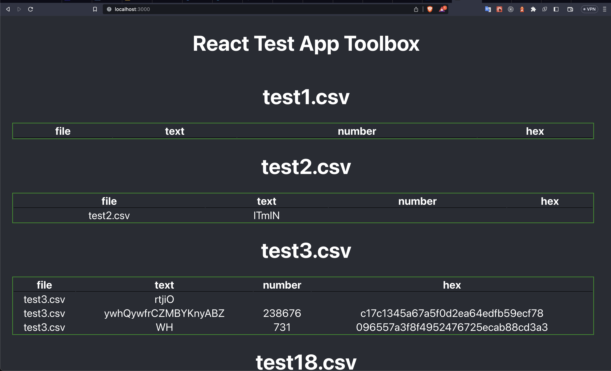

# FIRST STEPS

Create a file .env in the root path and add this:
```
COMPOSE_PROJECT_NAME=toolbox
APPVERSION=001
```


To start you need to up the container: 

```
    docker compose up -d --build
```

If you want to see the logs in your terminal take off -d 

```
    docker compose up  --build
```

# TROUBLESHOOTING 

The container it suppouse that will run all that you need but in case of error run this: 

npm install in server container 
```
    docker compose exec server npm install
```

npm install in client container 
```
    docker compose exec client npm install
```

# OPEN THE APP

To start interacting with the application, open `http://localhost:3000/` on a browser.

if you want to see if backend works, open `http://localhost:4000/` on a browser.

And you will see something like this: 

